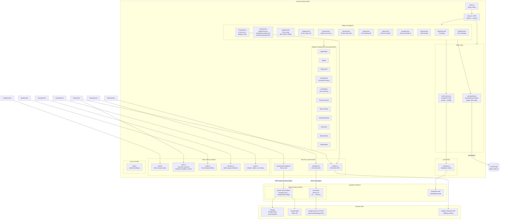
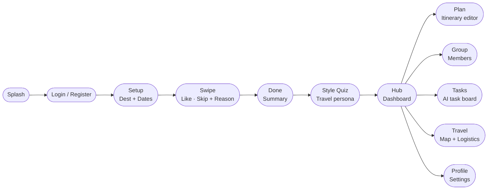

# Tripder — Project Architecture

## Project Overview

**Tripder** is a collaborative travel planning web app built with React + Vite. Inspired by swipe-style interfaces (think dating apps), it lets groups plan trips together by swiping on places and activities — but crucially, it also captures the *reasoning* behind each preference, enabling genuine group consensus instead of majority-rules domination.

**Key differentiator:** Instead of just aggregating a group's "yes/no" votes, Tripder surfaces the *why* behind every swipe, making negotiation and itinerary compromise transparent and fair.

---

## Tech Stack

| Layer | Technology |
|---|---|
| Frontend | React 19 + Vite 8 |
| Routing | React Router DOM v7 |
| Animation | Framer Motion 13 |
| Drag & Drop | @dnd-kit/react |
| Maps | Mapbox GL / react-map-gl |
| Icons | Phosphor React |
| Utilities | clsx |
| Auth & BaaS | Supabase JS v2 |
| Backend (Edge) | Supabase Edge Functions (Deno/TypeScript) |
| AI | Google Gemini 2.0 Flash (via Edge Function) |
| Places Search | SerpApi (Google Maps Autocomplete engine) |
| Static Maps | Google Maps Static API |
| Linting | oxlint |

---

## Architecture Diagram



---

## User Flow



---

## Directory Structure

```
WhereDo/
├── src/
│   ├── main.jsx                  # React entry point
│   ├── App.jsx                   # Shell: router, layout chrome, theme
│   ├── App.css / index.css       # Global styles + design tokens
│   │
│   ├── pages/                    # Screen-level route components (15 screens)
│   │   ├── SplashScreen.jsx      # Landing / onboarding
│   │   ├── LoginScreen.jsx
│   │   ├── RegisterScreen.jsx
│   │   ├── ForgotPasswordScreen.jsx
│   │   ├── ResetPasswordScreen.jsx
│   │   ├── SetupScreen.jsx       # Trip config (destination, dates, leader)
│   │   ├── SwipeScreen.jsx       # Core swipe + reason capture
│   │   ├── DoneScreen.jsx        # Post-swipe summary
│   │   ├── StyleScreen.jsx       # Travel style quiz
│   │   ├── HubScreen.jsx         # Trip dashboard / entry hub
│   │   ├── PlanScreen.jsx        # Itinerary editor (drag-drop, map)
│   │   ├── GroupScreen.jsx       # Group member management
│   │   ├── TasksScreen.jsx       # AI-powered task board
│   │   ├── TravelScreen.jsx      # In-trip logistics + Mapbox map
│   │   └── ProfileScreen.jsx     # User profile & auth settings
│   │
│   ├── components/               # Reusable UI components (13 files)
│   │   ├── AppHeader.jsx         # Top nav bar
│   │   ├── TabBar.jsx            # Bottom tab navigation
│   │   ├── SwipeCard.jsx         # Individual swipeable card
│   │   ├── InfiniteSpiral.jsx    # Animated swipe history visualization
│   │   ├── LineSidebar.jsx       # Timeline sidebar for plan view
│   │   ├── PreferenceForm.jsx    # Swipe reason capture form
│   │   ├── ReasonChips.jsx       # Tag chips for swipe reasons
│   │   ├── SatisfactionRing.jsx  # Group satisfaction indicator
│   │   ├── StyleCard.jsx         # Travel style option card
│   │   ├── BottomSheet.jsx       # Slide-up modal sheet
│   │   └── ProgressBar.jsx       # Progress indicator
│   │
│   ├── state/
│   │   └── useAppState.js        # Central app state hook (localStorage-backed)
│   │
│   ├── context/
│   │   ├── AuthContext.jsx       # Auth provider (Supabase session mgmt)
│   │   ├── auth-state.js         # React context object
│   │   └── useAuth.js            # useAuth consumer hook
│   │
│   ├── services/
│   │   ├── placesAutocomplete.js # Calls places-autocomplete edge function
│   │   ├── mapbox.js             # Calls Mapbox Directions API
│   │   └── taskAgent.js          # Calls task-agent edge function (Gemini AI)
│   │
│   ├── lib/
│   │   └── supabase.js           # Supabase client initialization
│   │
│   ├── data/                     # Static mock/seed data
│   │   ├── cards.js              # Swipe card content for Lisbon
│   │   ├── plans.js              # 3 preset itineraries + route legs
│   │   ├── styles.js             # Travel style personas
│   │   ├── members.js            # Mock group member profiles
│   │   └── travel.js             # Mock flights, hotels, car rentals
│   │
│   └── utils/
│       └── date.js               # Date range formatting
│
├── supabase/
│   └── functions/
│       ├── places-autocomplete/  # Deno edge fn: SerpApi proxy
│       │   └── index.ts
│       └── task-agent/           # Deno edge fn: Gemini AI task parser
│           └── index.ts
│
├── public/                       # Static assets (images)
├── index.html                    # Vite entry HTML
├── vite.config.js
└── package.json
```

---

## Key Architectural Decisions

| Decision | Rationale |
|---|---|
| **localStorage for app state** | `useAppState.js` persists the entire trip state (swipes, itinerary, tasks) to `localStorage` under `tripder-state-v1`. Simple, no backend DB needed for the core MVP flow. |
| **Supabase Auth only** | Supabase is used purely for authentication (email/password). No database tables — user data lives in Supabase Auth user metadata. |
| **Edge Functions as API proxies** | API secrets (SerpApi, Google Maps, Gemini) never reach the browser. All sensitive calls route through Supabase Deno edge functions. |
| **AI task extraction via Gemini** | The `task-agent` edge function sends natural-language trip messages to Gemini 2.0 Flash and gets back a structured JSON task list — enabling conversational task creation on the Tasks screen. |
| **Static itinerary data** | The three preset itineraries (`balanced`, `foodfirst`, `slower`) and swipe cards are hardcoded for the Lisbon MVP. User can layer drafts and custom "suggested" itineraries on top via `itineraryDrafts` / `userSuggestedItineraries` in state. |
| **No global state library** | All state is managed via a single custom hook (`useAppState`) passed as a prop — no Redux, Zustand, or similar, keeping the MVP lean. |
