# Tripder by The Nightbuddies
**Team:** MAH CAI YING, CHONG ZI XUAN, DARREN TAN YIK WEI, JACKSON LIM KIAN KIN

**Problem Statement:** Travel Planner

**Video Presentation:** [Unlisted Youtube Link](https://youtu.be/-muNQTizyz4)

**Presentation Slides:** [Presentation Slides](https://docs.google.com/presentation/d/1d4Pib9JE5ELed85vmTG1bL4Pav7hRRRQ/edit?usp=drive_link&ouid=107507996618683076851&rtpof=true&sd=true)

 # 1. Project Overview
**The Problem:**

Group travel is challenging not because travellers lack choices, but because group members often have different preferences, budgets, interests, and travel paces. These differences make reaching a common decision difficult, while plans can also change due to budget constraints, weather, availability, or changes in group preferences.

The main causes of the problem are:

• **Preferences Clash** – Members may prefer different destinations, food, or travel speeds.
• **Fragmented planning tools** – Existing applications generally separate itinerary planning, maps, and booking instead of helping groups make decisions collectively.
• **Difficult group decision-making** – Groups commonly rely on messaging apps like WhatsApp, polls, or lengthy discussions to reach an agreement.

The **key stakeholders** include **group travellers**, and **travel service providers**, such as **hotels** and **accommodation providers**, whose services are ultimately selected by travellers.
Several existing applications address parts of the travel-planning process. For example, Wanderlog allows users to organise trips, collaborate on itineraries, and manage travel information in one place. However, solutions such as Wanderlog primarily help groups organise and collaborate on a plan, rather than continuously resolve conflicting preferences and determine the best option for the entire group.

**Market gap** is:
The market does not simply need another itinerary builder. It needs a solution that continuously translates conflicting group preferences and changing circumstances into one adaptive decision.

**Our Solution:**

Tripder is an **AI-assisted multi-agent** group travel planner that helps travellers turn different individual preferences into one shared and practical itinerary through its **multi-agent** AI system—comprising the **Task Agent**, **Preference Agent**, **Group Planner Agent**, and **Itinerary Agent**—to resolve preference conflicts, support group decision-making, and continuously adapt travel plans to changing circumstances. Members can provide their interests, budget, dietary needs, and preferred travel pace, while Tripder analyses the group’s preferences to identify common ground and suggest suitable compromises. It then generates an itinerary that the group can review, customise, and confirm together. When circumstances change during the trip, Tripder can reassess the remaining schedule and suggest a revised plan instead of requiring travellers to manually rebuild their itinerary.

**Feature Set:**

**1. Smart Group Preference & Decision-Making** — Members set their individual interests, budgets, dietary requirements, and travel preferences, then collaboratively swipe and vote on proposed activities (like or dislike) while AI analyses group preferences, identifies common interests and conflicts, and recommends suitable compromises. 
**2. AI-Powered Itinerary Planning & Customisation** — Generate and compare multiple itinerary styles based on group preferences, time, budget, location, and travel constraints, then allow the group to customise and adjust activities before finalise the itinerary, and allow user to export finalised itinerary as a PDF for offline viewing.
**3. Group Confirmation** — Allow members to review and agree on the proposed itinerary before finalising it.
**4. Map & Route Planning** — View locations, routes, and transportation options on an interactive map.
**5. Estimated Travel Time** — Estimate the time of the planned trip to help assess its feasibility.
**6. Stay & Flight Search** — View relevant travel options through integrated API or mocked search data.

# 2. Ideation & Process
# 2.1 Ideas We Considered
During ideation, we explored several directions ranging from AI-assisted planning and group decision-making to travel discovery, navigation, community features, and post-trip experiences. We prioritised ideas that directly addressed the challenge of reducing planning friction and handling changing travel circumstances.

| Idea | Why it was dropped / kept |
| --- | --- |
| **AI-Powered Group Travel Planner (Chosen)** | Kept as the core concept. It directly addresses the main challenge of coordinating different preferences within a group. Users provide individual preferences, and AI analyses them to identify common ground, suggest compromises, and generate a shared itinerary. |
| **Task agent (Chosen)** | Kept. It addresses the coordination gap by converting natural-language requests into actionable trip tasks, allowing group members to assign responsibilities and track progress within Tripder instead of relying on separate messaging apps. |
| **Estimated Travel Time + Smart Suggestions (Chosen)** | Kept. These provide practical constraints for the AI-generated plan and help users understand whether an itinerary is realistic instead of simply generating a list of places. |
| **Search & Filter for Travel Options (Chosen)** | Kept in a lightweight form. Users can filter relevant stays, flights, and places using factors such as price, distance, category, or rating. Full booking functionality was intentionally excluded from the MVP. |
| **Live Events & Activities on the Map (Dropped)** | Dropped. Showing live events and activities could help travellers discover things to do, but it is not essential to solving the core group-planning problem. It would also require continuously updated event and availability data, increasing technical complexity and dependency on external APIs. |
| **Nearby Places & Transportation Suggestions(Dropped)** |Dropped. Nearby recommendations and transportation suggestions are useful for improving convenience, but similar functionality is already widely available through mapping and travel platforms. We decided to prioritise features that provide stronger differentiation through AI-powered group decision-making and itinerary adaptation. |
| **Travel Discovery / Location Review Platform (Dropped)** | Dropped. We considered a community-driven platform where users could review places, upload timestamped photos, create new locations, save favourites, view search history, and earn rewards. However, similar functionality is already well established in platforms such as Google Maps and other travel discovery services, making it difficult for Tripder to offer a strong differentiator. |
| **Travel Community / Forum (Dropped)** | Dropped. A travel forum for sharing itineraries, tips, food recommendations, and do's and don'ts was considered, but this would shift Tripder towards a social/community platform rather than solving the core group-planning and adaptive itinerary problem. |
| **Step-by-Step Travel Tutorial / Guide (Dropped)** | Dropped as a core feature. Tutorials for booking flights, preparing travel documents, and travelling abroad could help inexperienced travellers, but this is better suited to a general Help & Support section and is not central to the challenge. |
| **Auto-Generated Travel Vlog / Photo Album (Dropped)** | Dropped from MVP. Automatically creating a travel vlog or photo album from the trip timeline could provide a fun post-trip experience, but it does not directly solve the planning problem. It may be considered for a future version. |
| **Visitor Heatmap (Dropped)** | Dropped from MVP. A heatmap showing popular or crowded areas could support destination discovery, but it is not essential to the core planning workflow and would require additional reliable visitor-density data. |
| **Travel Buddy Matching  (Dropped)** | Dropped. Connecting travellers who do not know each other was considered, but it introduces a social matching problem that is outside the scope of the travel-planning challenge. |
| **Translator / Local Guide Marketplace (Dropped)** | Dropped from MVP. Translation and local-guide services may help travellers, but existing translation tools already address much of this problem and the feature is less connected to collaborative itinerary planning. |
| **Group Bill Splitting (Dropped)** | Dropped from the current MVP. Splitting costs is a genuine group-travel pain point, but implementing it would expand Tripder into financial tracking and distract from the stronger AI planning and replanning concept. |
| **Full Booking / Payment System (Dropped)** | Dropped. We considered allowing users to complete flight, hotel, and transportation bookings directly within Tripder. However, implementing booking and payment infrastructure would significantly increase scope. The MVP therefore focuses on discovery and recommendations, while users can proceed to the relevant provider to complete bookings. |
| **AI Replanning (Dropped)** | Dropped. Although AI replanning is highly relevant to Tripder, it overlaps with the core adaptive itinerary functionality of the chosen AI-powered group travel planner. Rather than treating it as a separate feature, we integrated it into the main planning workflow so the system can automatically reassess and update the itinerary when circumstances change. |
| **Trip Progress Tracking (Dropped)** | Dropped.Tracking visited and unvisited locations could improve itinerary awareness and support replanning, but it adds additional location-tracking complexity without directly addressing the primary group decision-making problem. Replanning can initially be triggered by user updates or changes in circumstances instead. |
| **Integrated Ride Comparison (Dropped)** | Dropped from MVP. Comparing ride-hailing or transportation options could help users find convenient travel routes, but it would require integration with multiple transportation providers and real-time pricing or availability data. Since transportation comparison is not central to Tripder's main value proposition, it was excluded to keep the MVP focused. |

# 2.2 Ideation Boards
[Ideation Boards](https://www.figma.com/design/To0ChwYyRJA6o1Bq3ccGEk/Tripder-%E2%80%94-Ideation-Boards-2.2?node-id=0-1&t=k0cLVsFp4jWV8w9h-1)

Mind Map

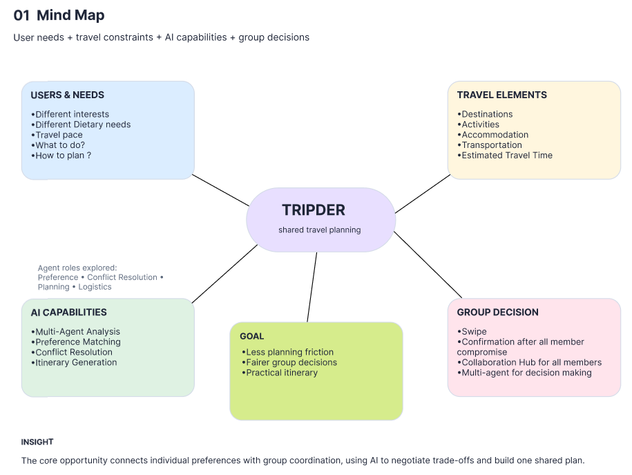

Problem Tree

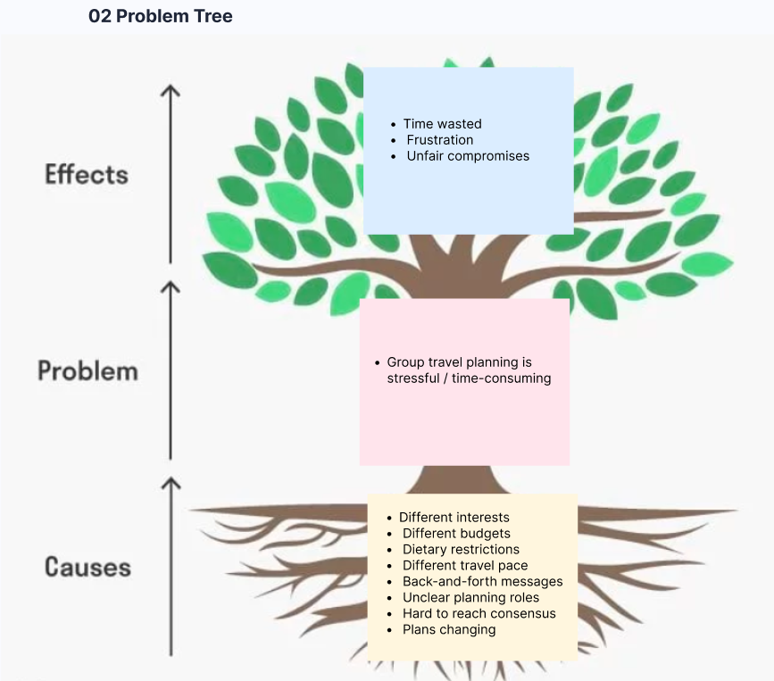

Crazy 8s
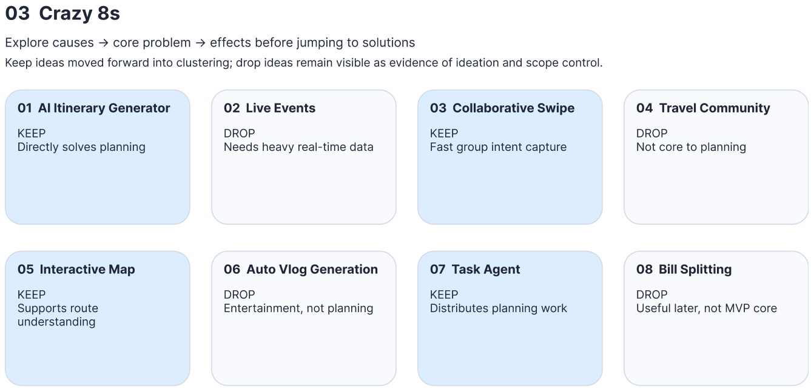
Affinity Diagram
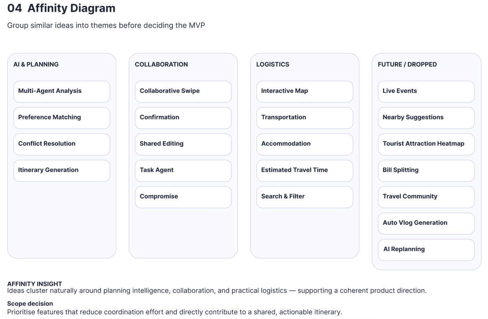
Ideas to MVP
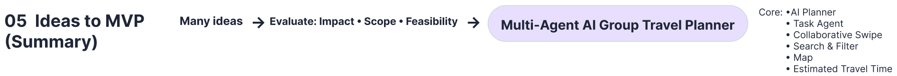

# 2.3 Mentor Consultation
| Date | Mentor | Feedback Received | What Was Changed |
| --- | --- | --- | --- | 
| 31 August 2026 | Khor Jia Quan | Suggested improving the architecture diagram using a clearer visual paradigm and considering accessibility requirements for different user groups, including users with disabilities. | Refined the architecture diagram for better clarity and considered accessibility requirements during the UI/UX design process. |
| 1 September 2026 | Teh Ming En | Recommended focusing on the AI replanning agent as the main “wow” feature, with a single disruption trigger such as weather. Also suggested improving the overall design pages, completing the user flow, and maintaining a consistent colour palette. | Prioritised the card swipe feature, narrowed the disruption scope, and improved the UI design and overall user flow. |
| 4 September 2026 | Lim Zi Yang | Suggested using real world data resources instead of hard-coded locations, using real flight/stay information, focusing on a specific niche, and considering future monetisation such as points and advertisements. | Refine the target scope and positioning. Some suggestions, such as a social-media-style travel forum and ride-hailing integration, were not prioritised due to time and MVP scope. |
| 10 September 2026 | Zach Khong | Giving advice on how to make the system even better, the focus should extend beyond simply addressing every point in the problem statement to prioritizing a premium user experience. Suggested on the swipe card feature could be made significantly more intelligent—if a user indicates a dislike for temples, all subsequent temple options would automatically be filtered out of during card swipe. | Prioritised refining user experience and interface flow to create a more polished product. Upgraded the swipe card feature with intelligent filtering logic to process user preferences. System now automatically removes disliked location categories from the card stack during interaction. |

Evidence:

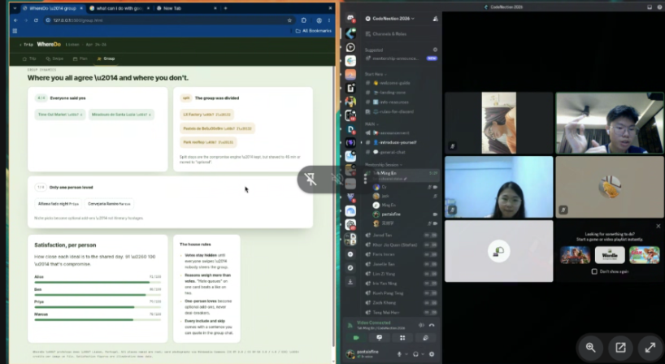

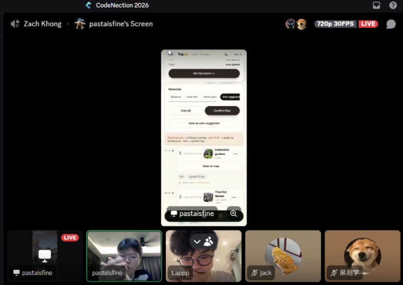

# 3. Design & Prototype
**UI Prototype:** [UI Prototype](https://tripder.vercel.app/)

**1. Crew Onboarding & Role Assignment**
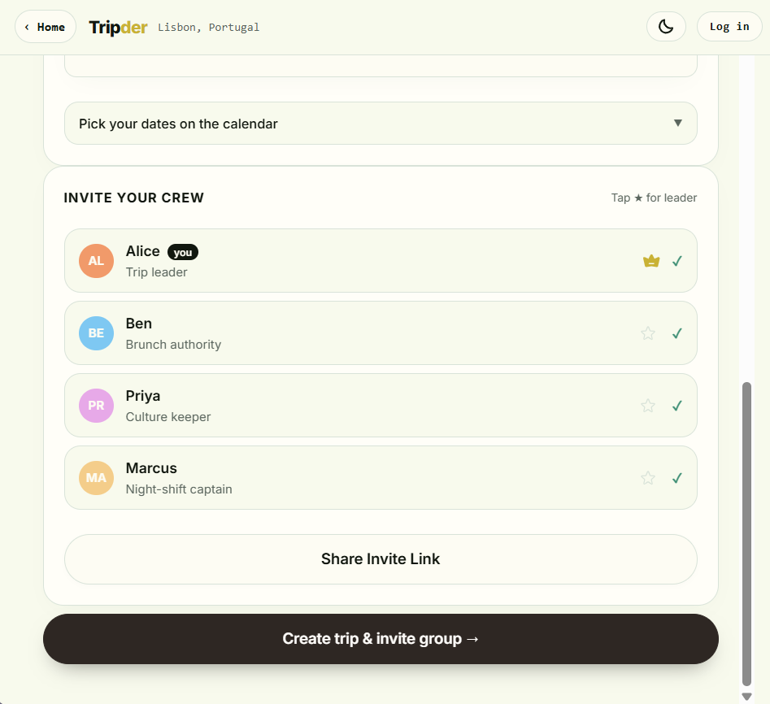
**Interaction:** Group leaders set up the trip and invite members through a shared link. The leader role can be passed to other members.

**2. Granular Preference Capture**
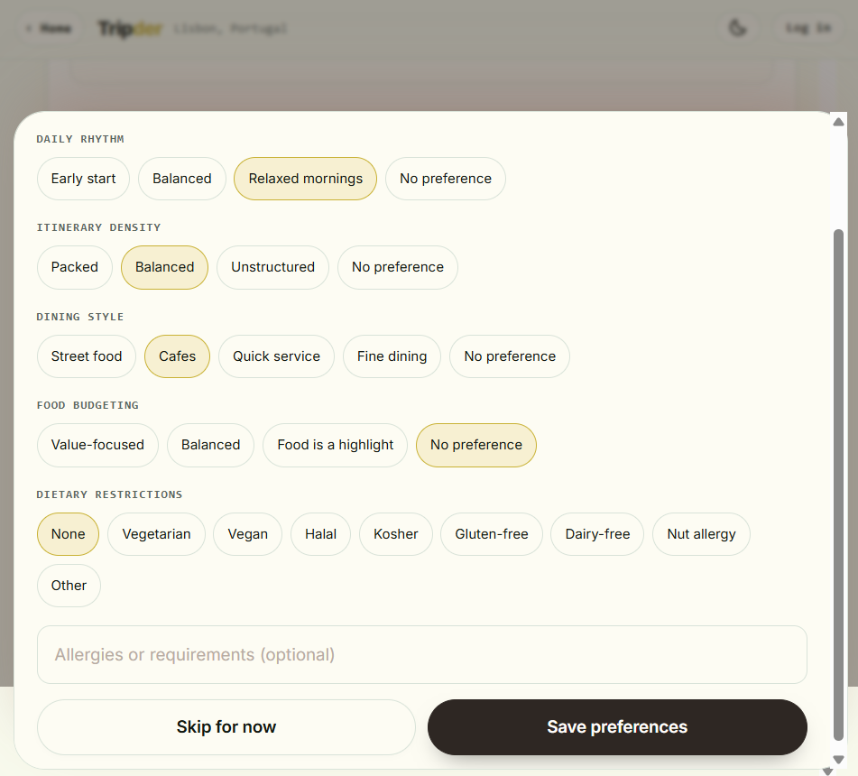
**Interaction:** Each member enters personal preferences and constraints, including interests, budget, dietary needs, and travel pace. This gives Tripder’s AI a complete picture of the group before generating a plan, helping surface potential conflicts early. 

**3. Card Swipe**
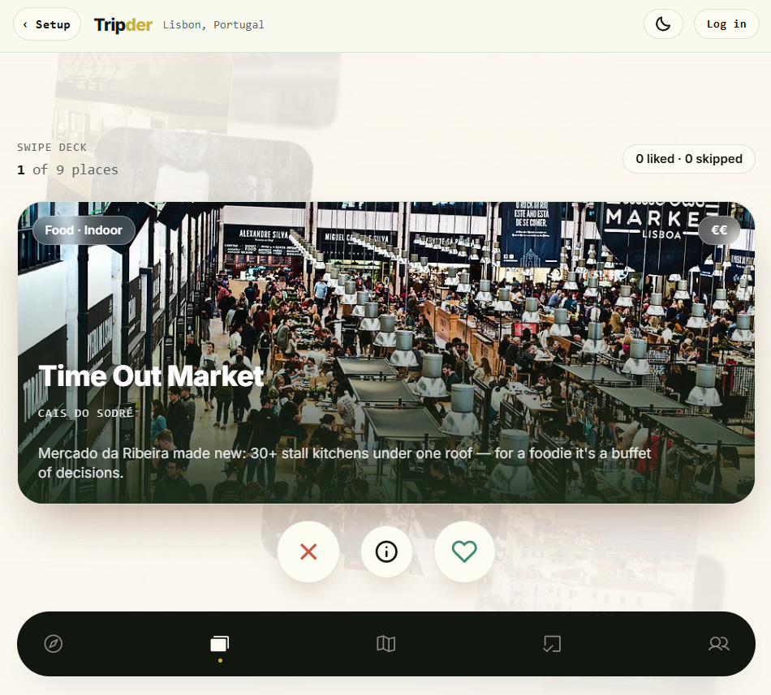
**Interaction:** Members swipe left or right on local spots and activities and provide a short reason for each choice. The AI combines both the choice and reasoning in real time to identify shared interests, explain disagreements, and find options that better fit the group. These preference insights can also be retained to improve recommendations for future trips.

**4. Shared Plan Map Visualization: See the Whole Trip, Not Just a List**
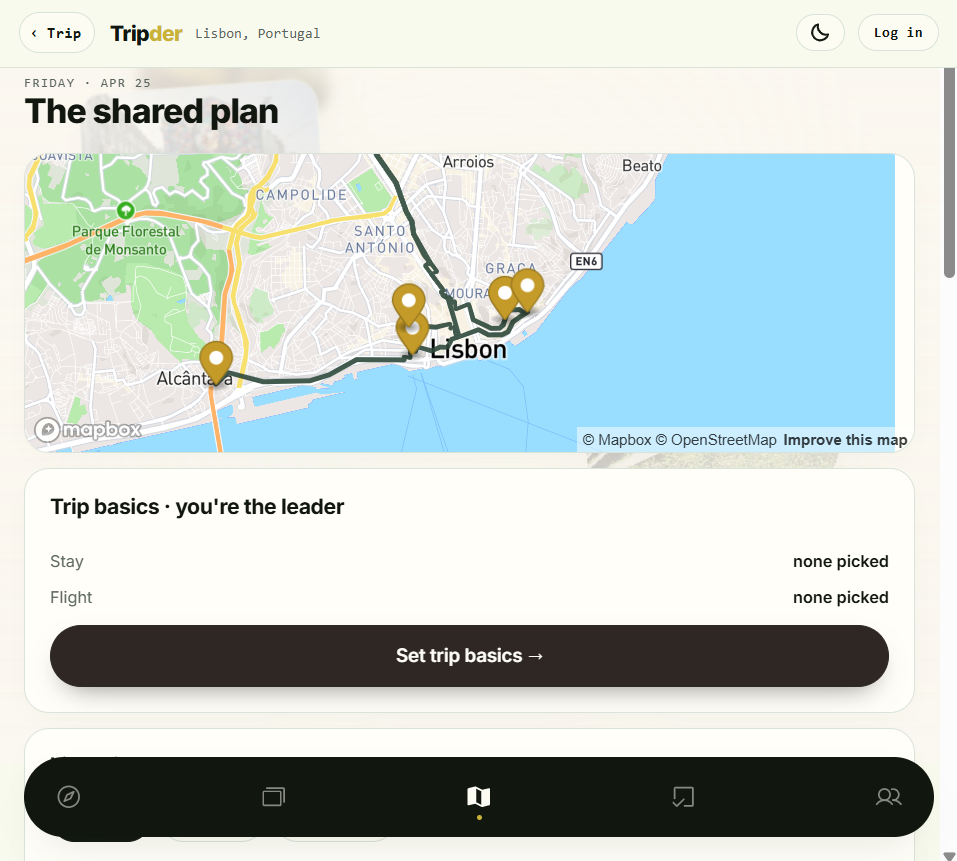
**Interaction:** Instead of viewing the itinerary as a long list of places, the group sees the entire daily route on a shared map, with destinations connected in geographic order. This lets members spot backtracking, unrealistic routes, and distant locations before agreeing on the plan.

**5. AI Itinerary Styles & Customisation: One Trip, Multiple Ways to Travel**
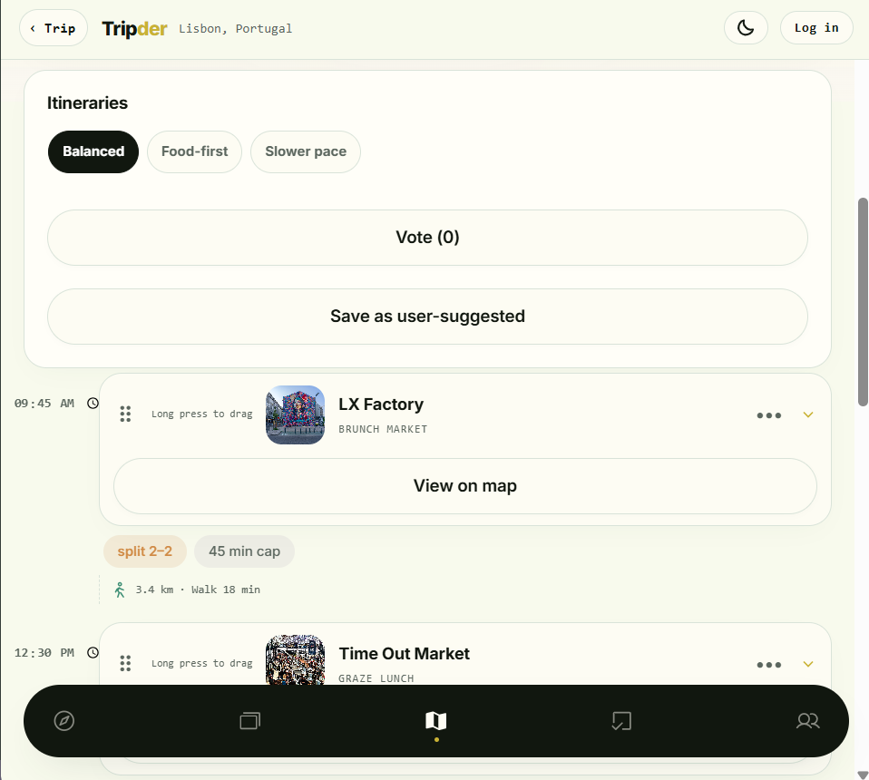
**Interaction:** Instead of forcing the group to agree on one plan immediately, Tripder generates different versions of the same trip — such as Balanced, Food-first, and Slower pace. Members can vote, rearrange activities, and adjust suggestions, making compromise easier without starting the itinerary from scratch.

**6. Task Agent & Board**
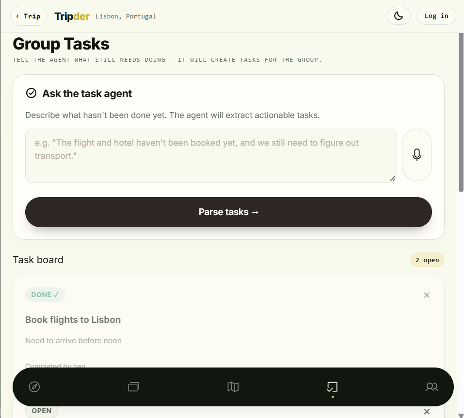
**Interaction:** When members type or speak natural-language messages containing single or multiple tasks (e.g., "We haven't booked the hotel yet"), the Task Agent instantly parses and converts them into trackable action items. The group can clearly see what needs to be done, who is in charge, and what's still pending—eliminating critical planning details buried in messy WhatsApp chats. Planning roles can then be assigned to different members, so responsibilities are shared from day one instead of falling on one person.

**7. Search & filter stay,flight**
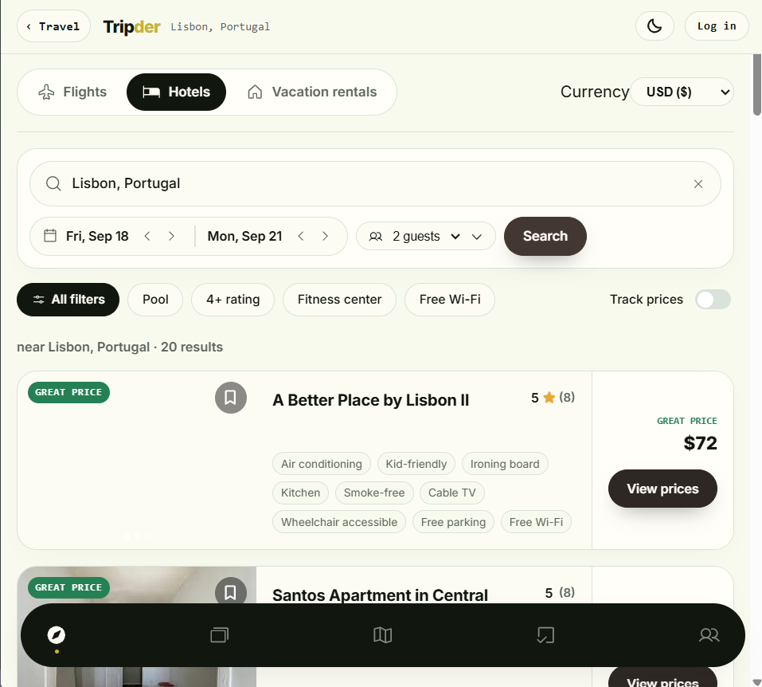
**Interaction:** Instead of switching between multiple travel websites while planning, members can search, filter, and compare stays and flights directly within the itinerary workflow. Options can be narrowed by price, category and ratings, making it easier to turn the group’s decisions into a practical trip. 

# 4. What Makes It Different
Tripder differentiates itself from conventional travel-planning applications by focusing on group decision-making rather than simply itinerary generation. Its core innovation is a **multi-agent AI system** that combines individual preferences, group voting, and contextual constraints to create and continuously adapt a shared travel plan.
| Feature | What Makes It Different |
| --- | --- |
| **AI Multi-Agent Trip Planning** | Instead of relying on a single AI itinerary generator, Tripder uses specialised agents—**Task Agent**, **Preference Agent**, **Group Planner Agent**, and **Itinerary Agent**—that work together to analyse group preferences, discover suitable options, resolve conflicts, and construct a shared itinerary. |
| **Reasoning-Aware Group Coordination Hub** | Goes beyond simple group voting or Tinder-style swiping. Members swipe on activities and can provide reasons for their choices, allowing the AI to understand why someone likes or dislikes an option and use that reasoning when finding compromises for the group. |
| **AI-Based Preference Conflict Resolution** | Instead of simply combining everyone's choices, Tripder identifies agreements, conflicts, priorities, and constraints between members and recommends compromises that aim to maximise overall group satisfaction. |
| **Integrated Travel Planning Hub** | Flights, hotels, activities, itinerary management, and group coordination are brought together within one trip workspace, allowing selected travel options to become constraints or anchor points for AI itinerary planning. |
| **Shared Group Workspace & Role Management** | A trip organiser can invite members through a shared link, with the inviter initially becoming the trip leader and the ability to transfer the leadership role to another member, providing clear responsibility for finalising group decisions. |

# 5. Technical Architecture & Feasibility
**Tech stack:**

Tripder is designed as a **mobile-first single-page web application**. The MVP uses a lightweight frontend architecture with Supabase for authentication and serverless functionality, while third-party APIs provide map, routing, and place-search capabilities.
| Technology | Purpose | Why We Chose It | Expected Constraints |
| --- | --- | --- | --- |
| **React 19 + Vite 8** | Frontend | React's component-based architecture is suitable for Tripder's interactive screens, while Vite provides fast development and lightweight production builds. | The application is currently a client-side SPA without SSR. |
| **Vanilla CSS** | UI styling | Provides full control over Tripder's responsive layouts, glassmorphism effects, animations, dark/light themes and visual design. | More styling needs to be maintained manually compared with a component/UI framework. |
| **React Router v7** | Client-side routing | Provides simple navigation between Tripder's screens while keeping the application as a single-page app. | No server-side routing or SSR. |
| **Custom useAppState + localStorage** | Application state | Tripder's MVP state is relatively lightweight and serialisable, so a custom state hook keeps the architecture simple without adding Redux/Zustand complexity. | State is currently device-local, so real-time synchronisation between group members is not yet supported. Browser storage is also limited in capacity. |
| **Supabase Auth** | Authentication | Provides ready-made sign-up, sign-in, session management and password-reset functionality without requiring us to build an authentication backend from scratch. | Free-tier authentication has rate limits that are sufficient for the competition MVP but would need scaling for production. |
| **Supabase PostgreSQL** | Database / future persistent storage | Provides a managed PostgreSQL database that can later support trips, groups, preferences and synchronised itinerary data. | The current MVP does not actively persist trip state to PostgreSQL; database synchronisation is planned as a future enhancement. |
| **Supabase Edge Functions (Deno/TypeScript)** | Secure API proxy | Keeps sensitive third-party API keys on the server side while allowing the frontend to request place-search data securely access **SerpApi**, **AssemblyAI**, and **Gemini API**. It avoids deploying a separate backend server. | The place-search feature depends on the deployed Edge Function. |
| **SerpApi** | Place autocomplete/search | Provides Google Maps-based place, Google hotels/accomodations and Google flights suggestions for users adding destinations and itinerary stops. | The free plan has limited monthly searches, which may restrict heavy demo usage. |
| **Assembly AI** | Speech-to-text | Converts users' spoken requests into text, enabling natural voice interaction with Tripder's Task Agent. | API usage is subject to available credits and processing limits. Speech recognition accuracy may also vary depending on background noise, accents, and recording quality. |
| **Gemini API** | AI reasoning, preference analysis, and itinerary generation | Powers Tripder's AI capabilities, including analysing individual group preferences, identifying agreements and conflicts, suggesting compromises, and generating itinerary options. It also enables the different AI agents in Tripder's **multi-agent** architecture to process and reason over travel information. | API usage is subject to model quotas, rate limits, and token usage. AI-generated recommendations may occasionally require user review for accuracy or suitability. |
| **Mapbox GL JS + react-map-gl** | Interactive maps | Provides interactive maps, markers and route visualisation that integrate naturally with React. | Map loads and API requests are subject to Mapbox usage limits. |
| **Mapbox Directions API** | Route calculation | Generates walking routes between itinerary stops and returns route geometry that can be rendered directly on the map. | API usage is subject to the available Mapbox quota. |
| **Vercel** | Frontend hosting | Both provide CDN-based static hosting, HTTPS and Git-based deployment suitable for a Vite application. | Free-tier bandwidth/build limits apply. |

**Security Consideration:**

Tripder separates public client-side credentials from sensitive server-side credentials.
The Supabase anon key and scoped Mapbox public token can be used by the browser. However, sensitive keys such as the **SerpApi key and Google Static Maps key are stored only as Supabase Edge Function secrets** and are never bundled into the frontend.

The **Gemini API key** used by Task Agent is securely stored as a Supabase Edge Function secret and is never exposed or bundled in the client-side application, ensuring that AI requests are handled through the server-side security boundary. 

This makes the Edge Function the main **security boundary** between the browser and sensitive third-party services.

**System architecture diagram**
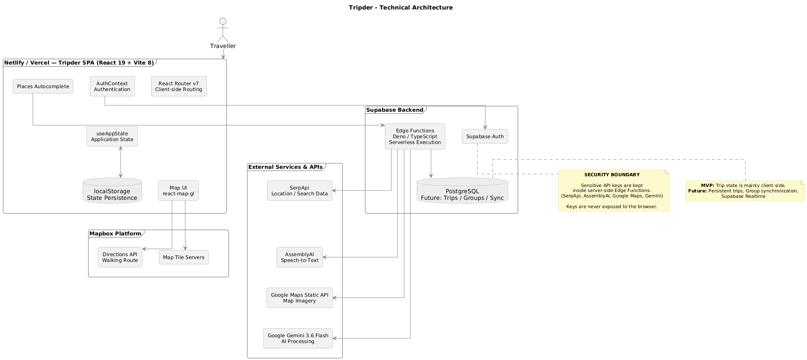

**Build plan & scope:**

During the building phase, we will develop a focused MVP of Tripder centred on **multi-agent** AI-powered group preference analysis and itinerary generation. The system will use Supabase for backend communication and real-time websocket group synchronisation, while specialised AI agents handle different stages of the planning process. 

We use Supabase as our backend platform to manage user authentication and store trip, group, preference, task, and itinerary data. We will also use **Supabase WebSocket** to synchronise group updates and itinerary voting in real time, while Supabase Edge Functions will securely connect our application to third-party APIs such as **SerpApi**, **AssemblyAI**, and **Gemini API**. 

**1. Discovery Service**

**Input:** Destination and search requirements

**Function:**
• Connect to **SerpApi** to fetch place information such as coordinates, images, Google ratings/reviews, and basic location details.
• Provide structured place data to the itinerary and group-planning components. 

**Note:** Discovery Service is an API service rather than an AI agent.

**2. Itinerary Agent**

**Input:** Destination, number of days, and available place data

**Function:**
• Generate activity/place cards for users to explore.
• Generate a personalised itinerary based on an individual's preferences and travel constraints.
• Organise AI suggested places into a practical daily schedule.

**3. Preference Agent**

**Input:** User profile, swipe preferences, and swipe reasons

**Function:**
• Analyse each user's likes, dislikes, and stated reasons about the place.
• Identify individual preferences and constraints.
• Generate a personal preference summary that can be used by the Group Planner Agent.

**4. Group Planner Agent**

**Input:** Individual preference summaries from all group members

**Function:**
• Compare group members' preferences.
• Identify common interests, conflicts, priorities, and constraints.
• Recommend compromises between conflicting preferences.
• Generate a shared group itinerary that balances the group's needs.

**5. Task Agent**

**Input:** Natural-language text or voice requests from group members.

**Function:**
• Convert users' messages or voice input into actionable travel tasks.
• Use **AssemblyAI** to convert voice input into text.
• Use the **Gemini API** to understand the request and identify relevant tasks.
• Automatically create tasks such as booking flights, booking accommodation, or preparing travel documents.
• Allow group members to assign tasks, update their status, and track outstanding responsibilities.

